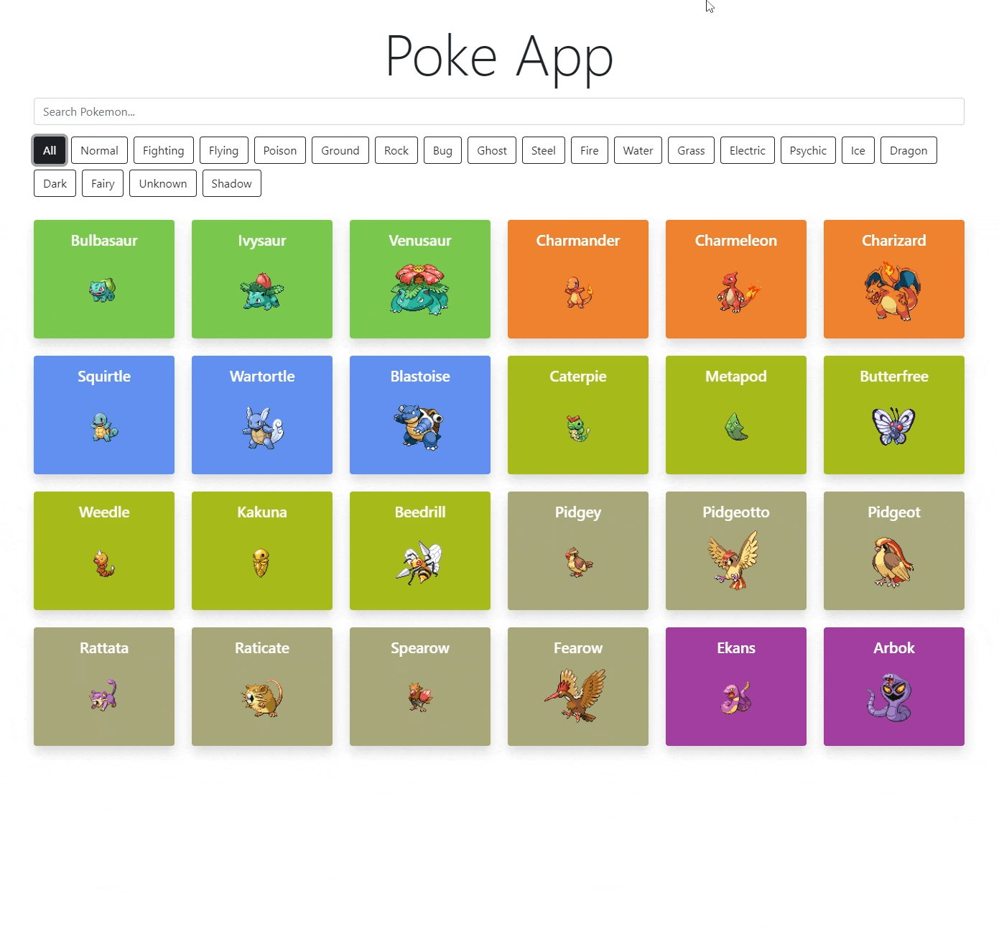

# Pokemon App

The Pokemon App is an Angular application that uses the [Poke API](https://pokeapi.co/) to load and filter through Pokemon Cards. This is Challenge #4 from [NUWE's IT Academy - Lliga de Programació](https://nuwe.io/event/it-academy-liga-de-programacion).

## **Preview**

## 

---

## :wrench: **Tech used in this project**

In this project I used Angular and Boostrap5 to develop a web app that initially loads 24 Pokemon Cards with Angular's Http Client and upon clicking any of the cards the user is presented with basic stats, specie's information, and evolution chain of the chosen Pokemon. The front page allows users to search by name of the loaded Pokemon. The background color of the cards as well as the border colors of the tags correspond to the 20 different pokemon types with Angular's NG class directive and conditional styling. The site is fully-responsive through the use of Bootstrap5 breakpoints.

---

## :mortar_board: **What did I learn from this project**

To use and understand an API with nested urls. To understand how to display various properties, since the pokemon API has a lot of information. I have required the use of different functions to get the correct data. Some by using loops to access the properties in the array. Each filter and search process is implemented in the different components, using the Angular services to share data.

---

## :memo: **What do I still need to do**

1. Functional filtering through type tags.

2. Dynamic search.

3. Pagination or Load More trough lazy load.

4. Design and style the app.


---

## :seedling: **Getting Started with this project**

This project was generated with [Angular CLI](https://github.com/angular/angular-cli) version 14.0.6.

## Development server

Run `ng serve` for a dev server. Navigate to `http://localhost:4200/`. The application will automatically reload if you change any of the source files.

## Installation

Clone or fork the Repo, and ensure that you have the [Angular CLI](https://github.com/angular/angular-cli) installed.

In the project directory.

```bash
npm install
```

In the project directory.

```bash
ng serve --open or ng s -o
```

## :bookmark_tabs: **Usage Instructions**

Upon starting live server, 24 Pokemon cards will load. Type in the name of the Pokemon you want to find in the search field, press enter to load the card, an error message will appear if the name is written incorrectly. 
Click on any of the cards to view that Pokemon's stats. Click on any evolution to load that pokemon stats.

## Contributing

Pull requests are welcome. For major changes, please open an issue first to discuss what you would like to change.

Please make sure to update tests as appropriate.

## License

[MIT](https://choosealicense.com/licenses/mit/)
